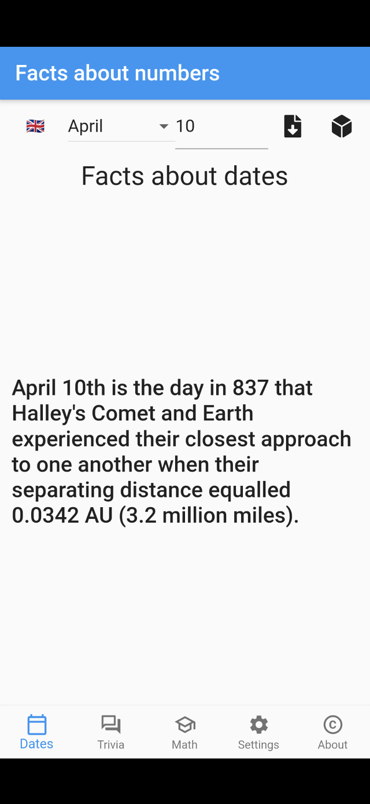

# Facts about Numbers

A simple flutter-client for [numbersapi](http://numbersapi.com/).

## Key features

* Shows a fact about the specified/random date
* Shows a trivia fact about the specified/random number
* Shows a math fact about the specified/random number
* Translates the current fact to one of the languages: 
    - Deutsch  🇩🇪
    - Français 🇫🇷
    - Español  🇪🇸
    - Русский 🇷🇺
    - Українська 🇺🇦
* Shows a fact about the current date on start

## How to build

1. Follow [this](https://flutter.dev/docs/get-started/install) tutorial on how to install and set up flutter for mobile development. 
2. Clone the repository: git clone https://github.com/xvadim/number_facts.git
3. Build and run:

`flutter run -d Android`

or

`flutter run -d iPhone`

or

`flutter run -d chrome`

4. Or just install from the [Google Play page](https://play.google.com/store/apps/details?id=org.xbasoft.number_facts)

